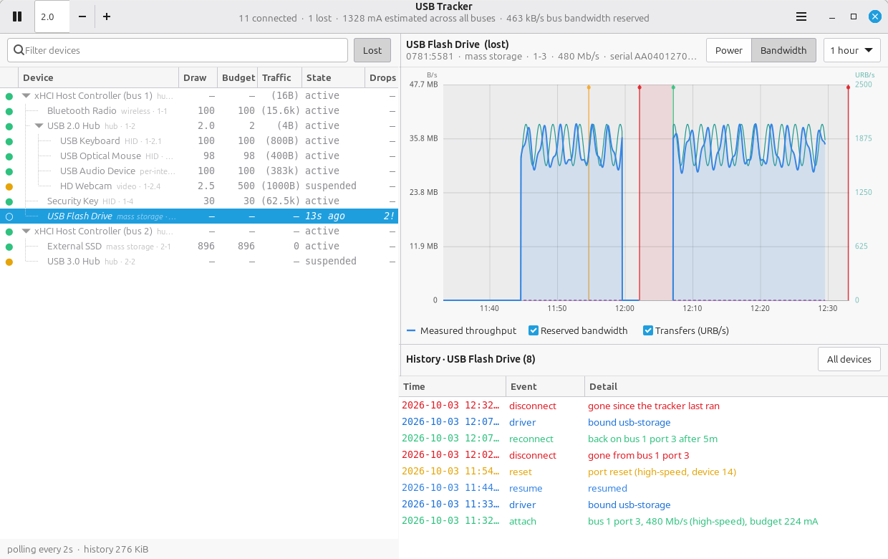
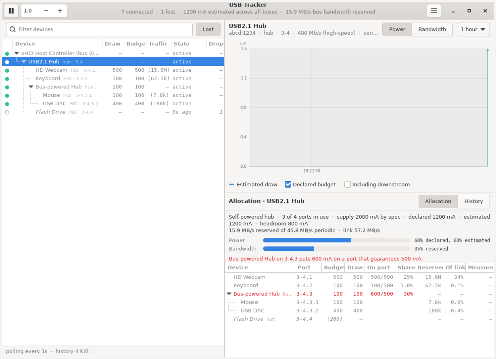

# usb-tracker

A desktop app for watching what is on your USB buses: how much power each
device is budgeted for, how much bus bandwidth it uses, and when things drop
off and come back.

It is built for one problem in particular: **a cluster of USB devices
vanishing together for a second or two.** When that happens the app does not
log fifteen unrelated disconnects — it correlates them into a single outage
and names what they had in common.


- **Left:** the live device tree, hub by hub. Devices that were seen and are
  now gone stay in place as shadows — dimmed, italic, hollow dot — so you can
  still select them and read their history.
- **Top right:** the selected device's history as a line graph — switch between
  **Power** and **Bandwidth** — with the declared figure, optional downstream
  total, shaded bands for the stretches it was missing, and markers for drops,
  returns and resets.
- **Bottom right:** that device's event log. For a hub, an **Allocation**
  page sits beside it: every device behind the hub with its power and
  bandwidth share.

Right-click a device to allow or prevent autosuspend, copy a udev rule to make
that stick, or export its history.

Nothing to install beyond PyGObject and GTK 4, no root, no kernel module.

## Running

```bash
./run.sh
```

or `python3 -m usbtracker`. Other modes:

```bash
python3 -m usbtracker --analyze         # diagnose from this boot's kernel log
python3 -m usbtracker --daemon          # record in a terminal, no window
python3 -m usbtracker --outages         # print recorded multi-device outages
python3 -m usbtracker --list            # print the tree once and exit
python3 -m usbtracker --events          # print the recorded event log
```

Useful options: `--interval SECONDS` (default 2), `--db PATH`,
`--keep-days N` (default 7), `--no-kmsg`.

History lives in `~/.local/share/usb-tracker/history.db` and survives
restarts, so the app knows about a device you unplugged last week. The daemon
and the window can share one database; run the daemon from a systemd user
service if you want a continuous record.

### Requirements

Python 3.10+, PyGObject and GTK 4. On Debian/Ubuntu:

```bash
sudo apt install python3-gi gir1.2-gtk-4.0
```

The headless modes (`--list`, `--events`, `--daemon`) need neither.



## When everything drops at once

Devices behind a hub do not fail independently. If a hub loses power, or its
upstream cable glitches, every device behind it disappears inside the same
second and comes back together. Logged device by device that looks like
chaos; correlated, it is one fault with one address.

The tracker groups disconnects that land within 8 seconds of each other, finds
the deepest point in the tree they all hang off, and records a single `outage`
event naming it — plus a second when they come back, with how long it took. A
red banner appears in the window, and **Outage report** in the menu lists what
has been seen.

Each outage also records **what that hub was carrying when it went**, taken
from the samples already on disk:

```
14 devices went away with the hub at 3-4 (USB2.1 Hub) -- the hub dropped
first and took everything behind it, carrying 2410 mA downstream at the time
(peaking at 2908 mA in the preceding minute)
```

That line is the difference between a theory and a finding. A self-powered hub
that drops while carrying close to its adapter's rating is browning out; one
that drops at idle is not, and the cable or the port is the better suspect.
The peak covers the preceding minute, because the spike that trips it — a
camera waking, a drive spinning up — usually lands a moment before the drop
rather than exactly on it.

The shape of the drop tells you where the fault is:

| What the log shows | What it means |
| --- | --- |
| The hub drops *first*, then its children | The hub itself lost power or its upstream link. Suspect its PSU, its cable, or the port it is in. |
| Children drop but the hub survives | The hub is fine; it cut power downstream or a shared downstream rail sagged. Suspect total current draw. |
| Devices across several controllers drop | Genuinely system-wide. Suspect the PSU, a PCIe/ASPM problem, or an SMI stall. |
| Accompanied by `controller` events | The host controller itself fell over — `xHCI host controller not responding` and friends. That is a different problem from a hub dropping. |
| A `stall` event at the same moment | The *tracker* stopped getting CPU, so the machine itself hiccuped. USB may not be the cause at all. |

### Diagnosing without waiting for it to happen again

The kernel ring buffer already holds this boot's history, so you do not have
to catch the next one live:

```bash
python3 -m usbtracker --analyze
```

It groups the log into disturbances, reports what each one had in common, and
says so plainly when every one of them points at the same hub. Where the
database already holds samples covering one of those moments, the recorded
downstream draw is shown alongside it.

### Catching the next one

An intermittent fault needs something always running. `packaging/` has a
systemd user service that records continuously; see
[packaging/README.md](packaging/README.md). The window reads the same
database, so its history shows up there too.

## How power is measured — read this before trusting a number

**Linux exposes no actual current measurement for USB devices.** No sysfs
attribute, no ioctl. Anything claiming to show real USB current is either
reading a hardware meter inline with the cable or guessing. This app guesses,
and says so:

| Shown | What it actually is |
| --- | --- |
| **Declared budget** | `bMaxPower` from the device's active configuration — the ceiling it negotiated, not what it draws. |
| **Estimated draw** | That budget weighted by the fraction of each interval the device spent powered up, from the kernel's runtime-PM counters (`power/runtime_active_time` and `power/runtime_suspended_time`). Suspended devices are floored at the 2.5 mA the spec allows. |
| **Including downstream** | A hub's own estimate plus every device behind it. This is the number to check against what the upstream port can actually supply. |

So a webcam idling at 2.5 mA against a 500 mA budget is really telling you
"suspended, allowed up to 500 mA" — not that it is drawing 2.5 mA. Treat the
graph as a duty-cycle and budget view, not a power meter.

**The connection events are not guesses.** Appearances and disappearances come
from sysfs, over-current trips from the port's `over_current_count`, and port
resets, failed enumerations and "device not accepting address" from the kernel
ring buffer. Those are the parts to trust when chasing a flaky cable or an
overloaded hub.

## How bandwidth is measured

USB bandwidth splits into three signals, and the app keeps them apart rather
than blending them into one made-up number.

| Shown | What it actually is | Covers |
| --- | --- | --- |
| **Reserved bandwidth** | Computed from the endpoint descriptors of the *active* alternate setting: payload × transactions ÷ polling interval, for interrupt and isochronous endpoints. This is bus time the host controller sets aside whether or not a byte moves. | Every device |
| **Measured throughput** | Real byte counters, read as deltas: `/sys/block/<dev>/stat` for USB storage and `/sys/class/net/<if>/statistics` for USB network adapters. | Storage and network devices only |
| **Transfers (URB/s)** | Rate of change of the device's `urbnum` — how many USB request blocks the kernel submitted per second. Activity, not volume. | Every device |

Reserved bandwidth is not a guess and it is not static. A webcam sitting idle
is parked on a zero-bandwidth alternate setting; the moment it starts
streaming the kernel switches it to one with real isochronous endpoints, the
reservation appears, and the app logs a `bandwidth` event. That is also why a
second camera on the same bus can fail to start even though nothing looks
busy — the bus time is already spoken for.

**Bulk transfers reserve nothing.** Flash drives, external disks and most
printers are best-effort by design, so their reserved figure is zero no matter
how hard they are working. For those, the measured byte counters are the real
answer, and the app shows them where the kernel provides them.

**There is no byte counter for the rest.** Keyboards, mice, audio interfaces
and cameras move data the kernel never totals anywhere in sysfs. Per-transfer
byte accounting needs `usbmon`, which lives in debugfs and requires root; this
app does not ask for root, so for those devices it shows reserved bandwidth
and URB rate and does not pretend to know the byte count.

## Hub allocation

Select a hub and the bottom right pane opens on **Allocation**, a table of
every device behind that hub, nested hubs included, with what each one takes:



| Column | What it is |
| --- | --- |
| **Budget / Draw** | The device's own declared bMaxPower and estimated draw, as in the tree. |
| **On port** | What the device puts on the hub's port, against what that port guarantees. A bus-powered hub carries everything behind it, so its figure includes its downstream. |
| **Share** | That load as a share of the hub's total supply. |
| **Reserved / Of link** | Periodic bandwidth reserved, and its share of what the hub's link allows for periodic transfers. |
| **Measured** | Real throughput, where the kernel counts bytes. |

Above the table, two bars show how much of the hub's power and bandwidth is
spoken for. They turn amber past 80% and red once the hub is over-committed,
and any port carrying more than it guarantees is listed and shown in red.
Devices that have gone stay in the table as shadows with their last declared
budget, but they do not count towards the totals. Double-click a row to jump
to that device in the tree.

**The supply figures are the USB spec's guarantees, not measurements.** A hub
cannot report what its adapter can really deliver, so supply means:

| Hub | Per port | Hub total |
| --- | --- | --- |
| Root hub or self-powered hub | 500 mA (USB 2), 900 mA (USB 3) | per-port figure × ports |
| Bus-powered hub | 100 mA (USB 2), 150 mA (USB 3) | its upstream port's 500/900 mA, less its own budget |

The port's allowance follows the speed the device connected at, so a USB 2
device on a USB 3 hub is held to the USB 2 figure. Periodic bandwidth is
capped at 80% of the link at USB 2 speeds and 90% at USB 3. A USB 3 hub shows
up as two hubs, one per speed, sharing the same physical ports and adapter, so
read the two tables together.

## What gets recorded

| Event | Meaning |
| --- | --- |
| `attach` | First time this device has ever been seen. |
| `reconnect` / `disconnect` | It came back / it went away. |
| `flap` | Gone and back inside 20 seconds — a marginal cable or a hub browning out, rather than someone unplugging it. |
| `reset` | The kernel re-reset the port (from the ring buffer). |
| `over-current` | The port's over-current counter moved, or the kernel logged a trip. |
| `bus error` | Failed enumeration, descriptor read error, address not accepted. |
| `suspend` / `resume` | Runtime power management parked or woke the device. |
| `config` | Power budget, configuration or link speed changed. |
| `bandwidth` | The device's reserved periodic bandwidth changed — typically a camera or audio interface switching alternate setting as a stream starts or stops. |
| `outage` | Several devices dropped together, attributed to what they share, with the downstream draw at that moment; a second one records the recovery and its duration. |
| `controller` | The host controller itself reported trouble (`xHCI host controller not responding`, `HC died`, reset or halt failures). |
| `stall` | The tracker went unscheduled for far longer than its interval — the machine was busy, asleep, or stopped. Events in that window may be missing. |
| `driver` | A kernel driver bound to or released an interface. |

A device is identified by `idVendor:idProduct:serial` where a serial exists, so
it keeps its history when you move it to another port. Without a serial, the
port path *is* the identity — two identical serial-less devices genuinely
cannot be told apart, and moving one to a different port reads as a new device.

## Changing autosuspend

Right-click any device in the tree:

| Item | What it does |
| --- | --- |
| **Allow autosuspend** | Writes `auto` to the device's `power/control`, letting the kernel suspend it when idle. |
| **Prevent autosuspend (keep powered)** | Writes `on`. Use this for the device that keeps dropping, waking slowly, or losing the first keystroke after an idle spell. |
| **Copy udev rule to make it stick** | Puts a matching rule on the clipboard. |
| **Copy device details** | Everything the app knows about the device, as text. |
| **Export history (CSV)** | Samples and events for that device. |
| **Forget this device** | Drops a device that is gone, with its history. |

Autosuspend is the kernel's setting, and `power/control` is owned by root, so
the change goes through **polkit** and you will be asked to authenticate. The
app never escalates by itself — the authentication dialog is polkit's own, and
you answer it.

**The change does not survive a replug or a reboot**, because the kernel
resets the attribute when the device re-enumerates. "Copy udev rule" gives you
the durable form:

```
sudo tee /etc/udev/rules.d/99-usb-power.rules   # paste the rule, then:
sudo udevadm control --reload
```

### Optional: narrow the authentication

Out of the box the app asks pkexec to perform a one-off write, which means
authorising a root shell, so polkit asks for a password every single time.
Installing the helper replaces that with a dedicated polkit action that can do
exactly one thing — set `power/control` on one validated device — and is
remembered for the rest of your session:

```bash
./packaging/install-helper.sh
```

It installs two files, `/usr/libexec/usb-tracker/usb-tracker-power-helper` and
`/usr/share/polkit-1/actions/dev.local.usbtracker.policy`, and prints the
command to remove them again. The app picks it up automatically.

## Reading the tree

| Marker | Meaning |
| --- | --- |
| Green dot | Connected and active |
| Amber dot | Connected, runtime-suspended |
| Red dot | Connected, but has logged an over-current or bus error |
| Hollow grey dot, dimmed italic | Seen before, gone now — the state column shows how long ago |
| `!` after the drop count | This device has also logged resets or errors |
| Traffic column, plain | Measured throughput, from real byte counters |
| Traffic column, in parentheses | Reserved bandwidth — no byte counter exists for this device |

Use the **Lost** button to hide shadows, the filter box to search by name,
vendor id, serial, port or driver, and the menu to forget devices you no longer
care about or export a device's samples and events as CSV.

## Layout

```
usbtracker/
  sysfs.py     reads /sys/bus/usb/devices into a snapshot, including
               endpoint descriptors and any attached byte counters
  kmsg.py      scrapes dmesg for resets, over-current, enumeration failures
               and host-controller faults
  analyze.py   groups the kernel log into outages and reports the common cause
  allocation.py  per-hub power and bandwidth allocation, from a snapshot
  monitor.py   diffs successive snapshots into events and samples
  store.py     SQLite: device roster, event log, power samples
  power.py     reads and changes power/control, via polkit when needed
  app.py       GTK 4 window: tree, Cairo graph, history, context menu
  __main__.py  CLI entry point
packaging/     privileged helper, its polkit action, and an installer
tests/         unit tests, with the sysfs scan injected
```

```bash
python3 -m unittest discover -s tests
```

## Known limits

- Power is an estimate, as described above.
- `dmesg` scraping is skipped silently when `kernel.dmesg_restrict` is set; the
  app still tracks everything sysfs can see. The header says when this happens.
- Polling means a device that drops and returns between two polls is invisible
  to the sysfs diff — but the kernel log usually still catches it. For chasing
  brief outages, run with `--interval 0.5`.
- Outage correlation needs at least three devices to drop together. A hub with
  one device behind it reads as an ordinary disconnect.
- Byte-level throughput is only available for devices the kernel already counts
  (storage, network). Everything else would need `usbmon`, which requires root.
- The device tree uses `GtkTreeView`, deprecated in GTK 4.10 and still fully
  functional in GTK 4.14. Moving to `GtkColumnView` is the obvious future
  cleanup.
- Autosuspend changes need polkit, and a polkit authentication agent has to be
  running. Without one, pkexec has no way to ask, and the app reports that the
  change was refused rather than failing silently.
