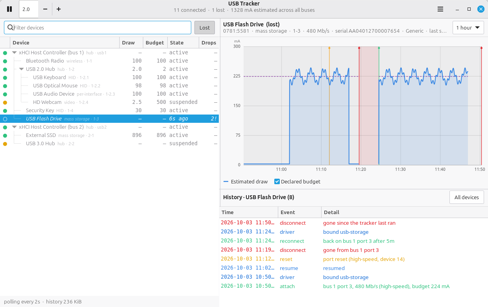

# usb-tracker

A desktop app for watching what is on your USB buses, how much power each
device is budgeted for, and when things drop off and come back.



- **Left:** the live device tree, hub by hub. Devices that were seen and are
  now gone stay in place as shadows — dimmed, italic, hollow dot — so you can
  still select them and read their history.
- **Top right:** the selected device's power history as a line graph, with the
  declared budget, optional downstream total, shaded bands for the stretches it
  was missing, and markers for drops, returns and resets.
- **Bottom right:** that device's event log.

Nothing to install beyond PyGObject and GTK 4, no root, no kernel module.

## Running

```bash
./run.sh
```

or `python3 -m usbtracker`. Other modes:

```bash
python3 -m usbtracker --daemon          # record in a terminal, no window
python3 -m usbtracker --list            # print the tree once and exit
python3 -m usbtracker --events          # print the recorded event log
```

Useful options: `--interval SECONDS` (default 2), `--db PATH`,
`--keep-days N` (default 7), `--no-kmsg`.

History lives in `~/.local/share/usb-tracker/history.db` and survives
restarts, so the app knows about a device you unplugged last week. The daemon
and the window can share one database; run the daemon from a systemd user
service if you want a continuous record.

### Requirements

Python 3.10+, PyGObject and GTK 4. On Debian/Ubuntu:

```bash
sudo apt install python3-gi gir1.2-gtk-4.0
```

The headless modes (`--list`, `--events`, `--daemon`) need neither.

## How power is measured — read this before trusting a number

**Linux exposes no actual current measurement for USB devices.** No sysfs
attribute, no ioctl. Anything claiming to show real USB current is either
reading a hardware meter inline with the cable or guessing. This app guesses,
and says so:

| Shown | What it actually is |
| --- | --- |
| **Declared budget** | `bMaxPower` from the device's active configuration — the ceiling it negotiated, not what it draws. |
| **Estimated draw** | That budget weighted by the fraction of each interval the device spent powered up, from the kernel's runtime-PM counters (`power/runtime_active_time` and `power/runtime_suspended_time`). Suspended devices are floored at the 2.5 mA the spec allows. |
| **Including downstream** | A hub's own estimate plus every device behind it. This is the number to check against what the upstream port can actually supply. |

So a webcam idling at 2.5 mA against a 500 mA budget is really telling you
"suspended, allowed up to 500 mA" — not that it is drawing 2.5 mA. Treat the
graph as a duty-cycle and budget view, not a power meter.

**The connection events are not guesses.** Appearances and disappearances come
from sysfs, over-current trips from the port's `over_current_count`, and port
resets, failed enumerations and "device not accepting address" from the kernel
ring buffer. Those are the parts to trust when chasing a flaky cable or an
overloaded hub.

## What gets recorded

| Event | Meaning |
| --- | --- |
| `attach` | First time this device has ever been seen. |
| `reconnect` / `disconnect` | It came back / it went away. |
| `flap` | Gone and back inside 20 seconds — a marginal cable or a hub browning out, rather than someone unplugging it. |
| `reset` | The kernel re-reset the port (from the ring buffer). |
| `over-current` | The port's over-current counter moved, or the kernel logged a trip. |
| `bus error` | Failed enumeration, descriptor read error, address not accepted. |
| `suspend` / `resume` | Runtime power management parked or woke the device. |
| `config` | Power budget, configuration or link speed changed. |
| `driver` | A kernel driver bound to or released an interface. |

A device is identified by `idVendor:idProduct:serial` where a serial exists, so
it keeps its history when you move it to another port. Without a serial, the
port path *is* the identity — two identical serial-less devices genuinely
cannot be told apart, and moving one to a different port reads as a new device.

## Reading the tree

| Marker | Meaning |
| --- | --- |
| Green dot | Connected and active |
| Amber dot | Connected, runtime-suspended |
| Red dot | Connected, but has logged an over-current or bus error |
| Hollow grey dot, dimmed italic | Seen before, gone now — the state column shows how long ago |
| `!` after the drop count | This device has also logged resets or errors |

Use the **Lost** button to hide shadows, the filter box to search by name,
vendor id, serial, port or driver, and the menu to forget devices you no longer
care about or export a device's samples and events as CSV.

## Layout

```
usbtracker/
  sysfs.py     reads /sys/bus/usb/devices into a snapshot
  kmsg.py      scrapes dmesg for resets, over-current and enumeration failures
  monitor.py   diffs successive snapshots into events and samples
  store.py     SQLite: device roster, event log, power samples
  app.py       GTK 4 window: tree, Cairo graph, history
  __main__.py  CLI entry point
tests/         unit tests, with the sysfs scan injected
```

```bash
python3 -m unittest discover -s tests
```

## Known limits

- Power is an estimate, as described above.
- `dmesg` scraping is skipped silently when `kernel.dmesg_restrict` is set; the
  app still tracks everything sysfs can see. The header says when this happens.
- Polling means a device that drops and returns between two polls is invisible
  to the sysfs diff — but the kernel log usually still catches it.
- The device tree uses `GtkTreeView`, deprecated in GTK 4.10 and still fully
  functional in GTK 4.14. Moving to `GtkColumnView` is the obvious future
  cleanup.
